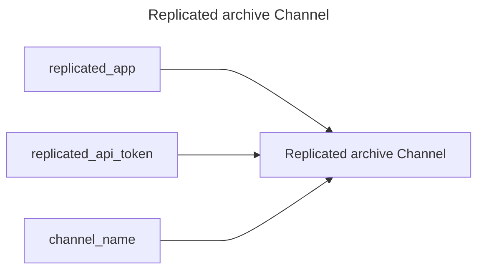

# Archive a channel

```mermaid
---
title: Replicated archive Channel
---
graph LR
replicated_archive_channel["Replicated archive Channel"]
replicated_app ---> replicated_archive_channel
replicated_api_token ---> replicated_archive_channel
channel_name ---> replicated_archive_channel
```