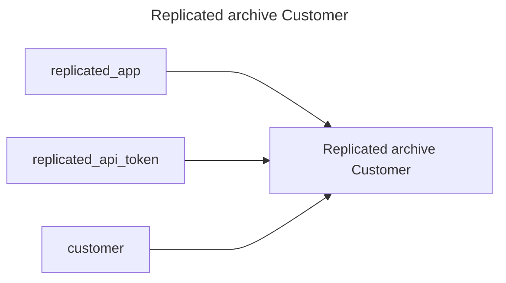

# Archive a customer

```mermaid
---
title: Replicated archive Customer
---
graph LR
replicated_archive_customer["Replicated archive Customer"]
replicated_app ---> replicated_archive_customer
replicated_api_token ---> replicated_archive_customer
customer ---> replicated_archive_customer
```