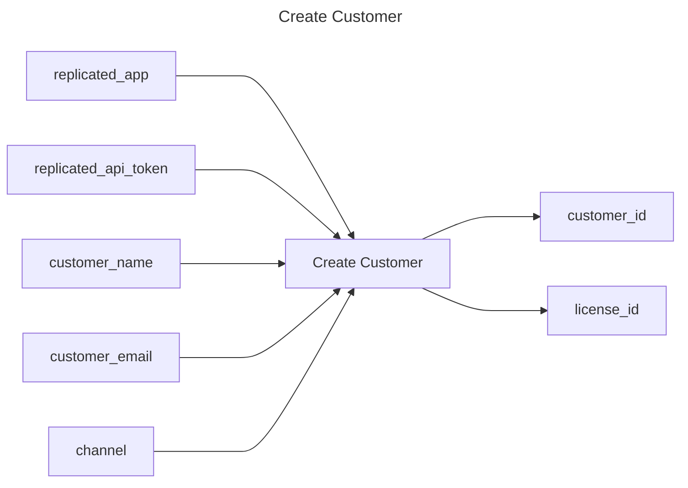

# Create a Customer and get the corresponding license id

```mermaid
---
title: Create Customer
---
graph LR
create_customer["Create Customer"]
replicated_app ---> create_customer
replicated_api_token ---> create_customer
customer_name ---> create_customer
customer_email ---> create_customer
channel ---> create_customer
create_customer ---> customer_id
create_customer ---> license_id
```